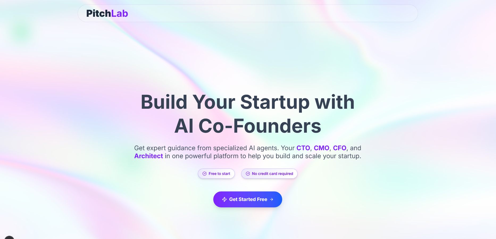

<div align="center">
  
  <p><strong>AI-Powered Startup Simulator</strong></p>
  <p>
    <a href="#features">Features</a> •
    <a href="#live-demo">Demo</a> •
    <a href="#tech-stack">Tech Stack</a> •
    <a href="#setup-instructions">Setup</a> •
    <a href="#usage">Usage</a> •
    <a href="#architecture">Architecture</a>
  </p>
</div>

<p align="center">
  
</p>

## 🌟 Overview

PitchLab is an innovative Next.js web application that simulates having AI co-founders for your startup venture. It provides expert guidance through specialized AI agents that help entrepreneurs make informed decisions about technical architecture, marketing strategies, financial planning, and project structure.

## ✨ Features

### AI Co-Founders

Meet your virtual startup team:

- **🧠 CTO Bot**: Technical architecture, tech stack recommendations, MVP development strategies, and scalability advice
- **📢 CMO Bot**: Marketing strategies, brand identity, user acquisition plans, and growth hacking
- **💰 CFO Bot**: Financial planning, pricing models, fundraising advice, and monetization strategies
- **🏗️ Architect Bot**: Project structure, folder organization, scalability patterns, and code organization

### 🚀 Key Functionality

- **Interactive Startup Idea Submission**: Submit your startup concept through a sleek dialog interface
- **Individual Chat Sessions**: Have in-depth conversations with each specialized AI agent
- **Boardroom Overview**: Get a comprehensive view of your startup concept with key insights
- **Real-time AI Responses**: Powered by Google's Gemini 2.5 Pro API for state-of-the-art AI responses
- **Beautiful UI**: Modern, responsive interface with smooth animations and elegant gradients

## 🛠️ Tech Stack

- **Frontend Framework**: Next.js 15, React 19, TypeScript
- **Styling**: 
  - Tailwind CSS 4.0 with custom gradients
  - Radix UI components for accessible UI elements
  - Custom animations with Framer Motion
- **AI Integration**: 
  - Google Gemini 2.5 Pro API
  - Custom prompt engineering for specialized agents
- **Visual Effects**:
  - OGL for WebGL iridescent background effects
  - Custom shader programming
- **UI Components**:
  - Lucide React for beautiful iconography
  - Custom card components with interactive effects
- **State Management**: 
  - React hooks (useState, useReducer)
  - Context-based message handling

## 🌐 Live Demo

Experience PitchLab live at: [https://pitchlab-demo.vercel.app](https://pitchlab-demo.vercel.app)

## 🚀 Setup Instructions

### 1. Clone and Install

```bash
# Clone the repository
git clone <your-repo-url>
cd pitchlab

# Install dependencies
npm install
```

### 2. Environment Setup

```bash
# Copy the environment template
cp .env.example .env.local

# Edit .env.local and add your Gemini API key
NEXT_PUBLIC_GEMINI_API_KEY=your_actual_api_key_here
```

**Get your Gemini API key**: 
- Visit [Google AI Studio](https://makersuite.google.com/app/apikey)
- Create a new API key
- Copy it to your `.env.local` file

### 3. Run the Development Server

```bash
npm run dev
```

Open [http://localhost:3000](http://localhost:3000) to see the landing page.
Navigate to [http://localhost:3000/chat](http://localhost:3000/chat) to start using the AI co-founders.

## 📱 Usage

1. **Start**: Visit the homepage and click "Get Started Free"
2. **Idea Submission**: Enter your startup idea in the beautifully designed modal
3. **Boardroom**: Review your idea in the main Boardroom interface
4. **Chat with AI**: Select any AI co-founder from the sidebar to start chatting:
   - 💻 **CTO Bot**: Ask about technical decisions, architecture, and development strategy
   - 📊 **CMO Bot**: Get marketing advice, branding tips, and customer acquisition strategies
   - 💰 **CFO Bot**: Discuss monetization, fundraising, and financial planning
   - 🏗️ **Architect Bot**: Get advice on code structure, organization, and scalability
5. **Receive Expert Guidance**: Get detailed, markdown-formatted responses with actionable advice

## 🔍 Key Features In-Depth

### Immersive UI Experience
- Custom iridescent WebGL background on the landing page
- Smooth animations and transitions between views
- Responsive design that works beautifully on all devices
- Elegant card-based message interface

### AI Agent Specialization
Each AI agent has been engineered with specific prompts to provide specialized advice:
- **CTO Bot**: Focuses on technical feasibility, architecture decisions, and development best practices
- **CMO Bot**: Provides marketing strategies, branding guidance, and user acquisition plans
- **CFO Bot**: Offers financial modeling advice, pricing strategies, and fundraising guidance
- **Architect Bot**: Gives project structure recommendations and code organization tips

### Interactive Chat Experience
- Real-time message delivery with typing indicators
- Markdown-formatted responses for better readability
- Code syntax highlighting for technical recommendations
- Message persistence during the session

## 📂 Project Structure

```
pitchlab/
├── app/                      # Next.js app directory
│   ├── chat/                 # Chat interface routes
│   │   └── page.tsx          # Main chat interface with AI co-founders
│   ├── layout.tsx            # Root layout with global styles
│   ├── globals.css           # Global CSS styles
│   └── page.tsx              # Landing page with hero section
├── components/               # React components
│   ├── ui/                   # Reusable UI components
│   │   ├── button.tsx        # Custom button component
│   │   ├── card.tsx          # Card component for messages
│   │   ├── dialog.tsx        # Modal dialog component
│   │   └── iridesceneBG.tsx  # WebGL background effect
│   ├── Boardroom.tsx         # Startup idea overview dashboard
│   ├── BotChat.tsx           # Bot message display
│   ├── ChatInput.tsx         # Message input component
│   ├── HeroSection.tsx       # Landing page hero section
│   ├── Navbar.tsx            # Navigation bar
│   └── Sidebar.tsx           # AI agent navigation sidebar
├── lib/                      # Utility functions and services
│   ├── architect.ts          # Architect bot prompt handler
│   ├── cto.ts                # CTO bot prompt handler
│   ├── cmo.ts                # CMO bot prompt handler
│   ├── cfo.ts                # CFO bot prompt handler
│   ├── formatters.ts         # Response formatting utilities
│   ├── gemini.ts             # Gemini API integration
│   └── utils.ts              # General utility functions
├── screenshots/              # Application screenshots
└── package.json              # Project dependencies and scripts
```

## 🧩 Key Components

### Chatroom Interface (app/chat/page.tsx)
The main chat interface that:
- Presents a startup idea submission modal
- Manages separate chat states for multiple AI agents
- Handles message sending and receiving with loading states
- Integrates with Google's Gemini API for AI responses
- Renders markdown-formatted responses with syntax highlighting

### AI Agent System (lib/)
Each agent has a specialized prompt handler:
- `cto.ts`: Technical expertise and development strategy
- `cmo.ts`: Marketing, branding, and user acquisition
- `cfo.ts`: Financial planning and monetization strategies
- `architect.ts`: Project structure and organization

### UI Components
- **Boardroom.tsx**: Dashboard overview of the startup idea with beautiful animations
- **Sidebar.tsx**: Navigation sidebar with gradient-styled agent selection
- **ChatInput.tsx**: Message input with auto-resize and keyboard shortcuts
- **iridesceneBG.tsx**: Custom WebGL shader for creating the interactive background effect

## 💡 Development Highlights

- **TypeScript Implementation**: Full type safety with proper interfaces
- **Modern React Patterns**: Leveraging React 19 features and hooks
- **AI Integration**: Sophisticated prompt engineering for specialized agents
- **Performance Optimization**: Efficient rendering with proper state management
- **Responsive Design**: Mobile-first approach with adaptive layouts
- **Animation Effects**: Subtle motion design for enhanced UX
- **Error Handling**: Robust error management for API calls

## 🚀 Deployment

```bash
# Build for production
npm run build

# Start production server
npm start
```

For deployment on Vercel, Netlify, or similar platforms, make sure to set the `NEXT_PUBLIC_GEMINI_API_KEY` environment variable in your hosting platform's settings.

## 📱 Screenshots

<p align="center">
  
  
  
</p>

## 🔮 Future Enhancements

- User authentication for personalized startup advice
- Chat history persistence across sessions
- Export functionality for advice and recommendations
- More specialized AI agents for different business domains
- File upload capability for startup pitch decks
- Integration with project management tools

## 📄 License

This project is licensed under the MIT License - see the LICENSE file for details.

## 🙏 Acknowledgements

- [Next.js](https://nextjs.org/) for the powerful React framework
- [Tailwind CSS](https://tailwindcss.com/) for the utility-first CSS framework
- [Google's Gemini API](https://ai.google.dev/) for the advanced AI capabilities
- [Radix UI](https://www.radix-ui.com/) for accessible UI components
- [Lucide React](https://lucide.dev/) for the beautiful iconography
- [OGL](https://github.com/oframe/ogl) for WebGL rendering
